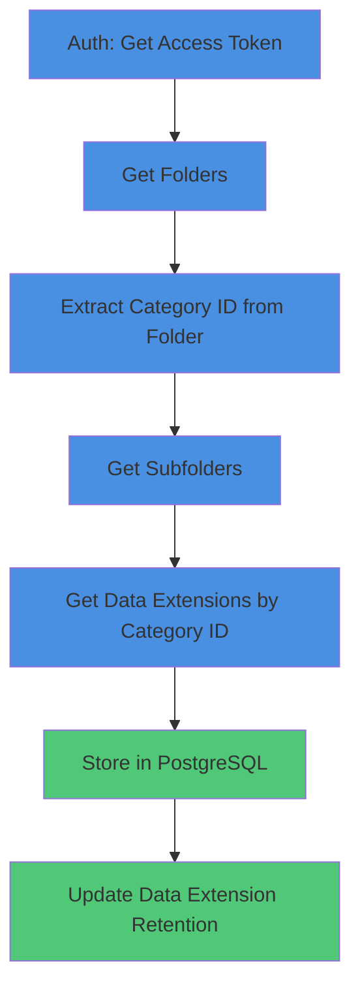

# Data Retention

A Go application for synchronizing Salesforce Marketing Cloud folders, subfolders, and data extensions, and managing data retention properties. This tool helps automate the process of updating data retention settings across multiple data extensions in Salesforce Marketing Cloud.

## Overview

Provides two main functionalities:
1. **Sync**: Fetches and stores folders, subfolders, and data extensions from Salesforce Marketing Cloud into a PostgreSQL database
2. **Update Retention**: Updates data retention properties for specific data extensions

**Workflow**: Audience builder → Contact builder → Data extension → Active journey → Data retention edit → Retention setting on | Individual record | After 3 months save

## Prerequisites

- Go 1.24.2 or later
- PostgreSQL database
- Salesforce Marketing Cloud account with API access
- Client ID and Client Secret from Salesforce Marketing Cloud

## Installation

1. Clone the repository:
```bash
git clone <repository-url>
cd sforce
```

2. Install dependencies:
```bash
go mod download
```

3. Build the application:
```bash
make build
```

Or build manually:
```bash
go build -o sforce main.go
```

## Configuration

Create a `.env` file in the project root with the following variables:

```bash
# Salesforce Marketing Cloud API Configuration
AUTH_BASE_URI=https://your-subdomain.auth.marketingcloudapis.com
REST_BASE_URI=https://your-subdomain.rest.marketingcloudapis.com
CLIENT_ID=your_client_id
CLIENT_SECRET=your_client_secret
SCOPE=offline documents_and_images_read documents_and_images_write saved_content_read saved_content_write automations_execute automations_read automations_write journeys_execute journeys_read journeys_write email_read email_send email_write push_read push_send push_write sms_read sms_send sms_write
ACCOUNT_ID=your_account_id

# Database Configuration
DB_HOST=localhost
DB_PORT=5432
DB_USER=postgres
DB_PASSWORD=your_password
DB_NAME=sforce
DB_SSLMODE=disable
```

**Security Note**: Never commit your `.env` file or expose client credentials. Store them securely and use environment variables in production.

## Database Setup

1. Create the database:
```bash
createdb sforce
```

2. Run migrations:
```bash
make migrate-up
```

This will create the necessary tables for storing folders, subfolders, data extensions, and sync job tracking.

## Usage

### Sync Folders and Data Extensions

Sync all folders, subfolders, and data extensions from Salesforce Marketing Cloud:

```bash
make run
```

Or run directly:
```bash
go run main.go
```

This will:
- Authenticate with Salesforce Marketing Cloud
- Fetch all folders matching the allowed types
- Fetch subfolders for each folder
- Fetch data extensions for each category
- Store all data in PostgreSQL
- Display sync metrics

### Update Data Retention

Update data retention for a specific data extension:

```bash
go run cmd/update_retention.go <DATA_EXTENSION_ID>
```

Example:
```bash
go run cmd/update_retention.go fe4cf83c-2cc4-f011-a5ab-d4f5ef66f377
```

This will update the data extension's retention properties to:
- Retention setting: **ON**
- Retention type: **Individual record**
- Retention period: **3 months**

## Flow Diagram



## API Reference

### Authentication

**Endpoint**: `{AUTH_BASE_URI}/v2/token` (POST)

**Request Body**:
```json
{
  "grant_type": "client_credentials",
  "client_id": "your_client_id",
  "client_secret": "your_client_secret",
  "scope": "offline documents_and_images_read documents_and_images_write saved_content_read saved_content_write automations_execute automations_read automations_write journeys_execute journeys_read journeys_write email_read email_send email_write push_read push_send push_write sms_read sms_send sms_write ...",
  "account_id": "your_account_id"
}
```

**Important Considerations**:
- Don't request a new access token for every API call—each access token is reusable and remains valid for 20 minutes
- Making two API calls for every one operation is inefficient and causes throttling
- Be careful where you store your client ID and secret. Never expose this information on the client side via JavaScript or store it in a mobile application
- Ensure that these credentials are stored securely in your application

### Get Folders

**Endpoint**: `{REST_BASE_URI}/legacy/v1/beta/folder?$where=allowedtypes in ('synchronizeddataextension', 'dataextension', 'shared_data', 'recyclebin')&Localization=true`

**Method**: GET

**Sample Response**:
```json
{
    "startIndex": 0,
    "itemsPerPage": 50,
    "totalResults": 41,
    "entry": [
        {
            "id": "1684",
            "type": "email",
            "lastUpdated": "2025-11-18T18:40:15.096Z",
            "createdBy": 0,
            "parentId": "0",
            "name": "my emails",
            "description": "",
            "iconType": "email"
        }
    ]
}
```

**Note**: The `id` field in the response is the `CATEGORY_ID` used for subsequent API calls.

### Get Subfolders

**Endpoint**: `{REST_BASE_URI}/legacy/v1/beta/folder/{CATEGORY_ID}/children`

**Method**: GET

**Sample Response**:
```json
{
    "startIndex": 0,
    "itemsPerPage": 50,
    "totalResults": 67,
    "entry": [
        {
            "id": "2416",
            "type": "dataextension",
            "lastUpdated": "2025-11-20T05:11:37.934Z",
            "createdBy": 0,
            "parentId": "1708",
            "name": "MasterSubscriber",
            "description": "",
            "iconType": "dataextension"
        }
    ]
}
```

### Get Data Extensions

**Endpoint**: `{REST_BASE_URI}/data/v1/customobjects/category/{CATEGORY_ID}?retrievalType=1&$page=1&$pagesize=25&$orderBy=modifiedDate%20DESC`

**Method**: GET

**Sample Response**:
```json
{
    "items": [
        {
            "0": {
                "id": "fe4cf83c-2cc4-f011-a5ab-d4f5ef66f377",
                "name": "Test_Admin149_Birthday Marketing_Campaign_Loyalty - 2025-11-17T211114668",
                "key": "D8BF4AF0-36DB-43D2-9C66-1364FE3A5D34",
                "description": "",
                "isActive": true,
                "isSendable": true,
                "sendableCustomObjectField": "LoyaltyProgramMember:Contact:Id",
                "sendableSubscriberField": "_SubscriberKey",
                "isTestable": false,
                "categoryId": 1708,
                "ownerId": 714433259,
                "isObjectDeletable": true,
                "isFieldAdditionAllowed": true,
                "isFieldModificationAllowed": true,
                "createdDate": "2025-11-18T03:11:14Z",
                "createdById": 714433259,
                "createdByName": "bima",
                "modifiedDate": "2025-11-18T17:36:20Z",
                "modifiedById": 714434465,
                "modifiedByName": "Alfin Surya 2",
                "ownerName": "bima",
                "partnerApiObjectTypeId": 310,
                "partnerApiObjectTypeName": "DataExtension",
                "rowCount": 0,
                "dataRetentionProperties": {
                    "dataRetentionPeriodLength": 3,
                    "dataRetentionPeriodUnitOfMeasure": 5,
                    "isDeleteAtEndOfRetentionPeriod": false,
                    "isRowBasedRetention": true,
                    "isResetRetentionPeriodOnImport": false
                },
                "fieldCount": 7
            }
        }
    ]
}
```

### Update Data Retention

**Endpoint**: `{REST_BASE_URI}/data/v1/customobjects/{DATA_EXTENSION_ID}`

**Method**: PATCH

**Request Body**:
```json
{
    "dataRetentionProperties": {
        "isResetRetentionPeriodOnImport": false,
        "isDeleteAtEndOfRetentionPeriod": false,
        "isRowBasedRetention": true,
        "dataRetentionPeriodLength": 3,
        "dataRetentionPeriodUnitOfMeasure": 5
    }
}
```

**Property Descriptions**:
- `isRowBasedRetention`: Retention setting (true = ON, false = OFF)
- `dataRetentionPeriodLength`: Retention duration (e.g., 3)
- `dataRetentionPeriodUnitOfMeasure`: Unit of measure (5 = months)
- `isDeleteAtEndOfRetentionPeriod`: Whether to delete records at end of retention period
- `isResetRetentionPeriodOnImport`: Whether to reset retention period on import

## Makefile Commands

The project includes several useful Makefile commands:

- `make build` - Build the application
- `make run` - Run the main sync application
- `make migrate-up` - Run database migrations
- `make migrate-down` - Drop all database tables (with confirmation)
- `make migrate-status` - Check migration status
- `make migrate-reset` - Reset database schema (with confirmation)
- `make db-connect` - Connect to the database using psql

## Project Structure

```
sforce/
├── cmd/
│   └── update_retention.go    # Command to update data retention
├── pkg/
│   ├── config/                   # Configuration management
│   ├── http/                     # HTTP client utilities
│   └── sforce/                   # Salesforce API client
├── schema/
│   └── postgres/                 # Database schema and migrations
│       ├── migrations/           # SQL migration files
│       ├── queries/              # SQLC query files
│       └── gen/                  # Generated code (SQLC)
├── services/                     # Business logic services
│   ├── dataextension.go         # Data extension service
│   ├── folder.go                # Folder service
│   └── sync.go                  # Sync service
├── main.go                      # Main sync application
├── Makefile                     # Build and migration commands
└── README.md                    # This file
```

## Data Retention Properties

The application updates data extensions with the following retention settings:

- **Retention Setting**: ON (`isRowBasedRetention: true`)
- **Retention Type**: Individual record (`isRowBasedRetention: true`)
- **Retention Period**: 3 months (`dataRetentionPeriodLength: 3`, `dataRetentionPeriodUnitOfMeasure: 5`)
- **Delete at End**: OFF (`isDeleteAtEndOfRetentionPeriod: false`)
- **Reset on Import**: OFF (`isResetRetentionPeriodOnImport: false`)

**Note**: `dataRetentionPeriodUnitOfMeasure` values:
- `1` = Days
- `2` = Weeks
- `3` = Years
- `5` = Months

## References

- [Salesforce Marketing Cloud Authentication Guide](https://developer.salesforce.com/docs/marketing/marketing-cloud/guide/get-access-token.html)
- [Get Client ID and Secret](https://docs.adverity.com/guides/authorizations/salesforce-marketing-cloud-authorization.html)
- [Data Extensions API Reference](https://developer.salesforce.com/docs/marketing/marketing-cloud/references/mc-custom_objects?meta=getDataExtensions)
