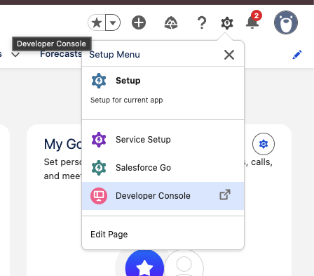
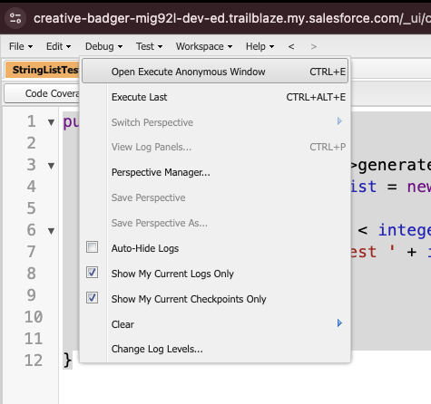

# Apex

Apex is a programming language that uses Java-like syntax and acts like database stored procedures. Apex enables developers to add business logic to system events, such as button clicks, updates of related records, and Visualforce pages.

**Why Apex?**
- Cloud development as Apex is stored, compiled, and executed in the cloud.
- Triggers, which are similar to triggers in database systems.
- Database statements that allow you to make direct database calls and query languages to query and search data.
- Transactions and rollbacks
- The globalCopy access modifier, which is more permissive than the publicCopy modifier and allows access across namespaces and applications.
- Versioning of custom code.

## SObjects
Because Apex is tightly integrated with the database, you can access Salesforce records and their fields directly from Apex. Every record in Salesforce is natively represented as an [sObject](https://developer.salesforce.com/docs/atlas.en-us.apexref.meta/apexref/apex_methods_system_sobject.htm) in Apex. For example, the Acme account record corresponds to an Account sObject in Apex. The fields of the Acme record that you can view and modify in the user interface can be read and modified directly on the sObject as well.

## Running Apex 
### Developer Console
1. To open the Developer Console from Lightning Experience: Click the quick access menu (Gear icon in upper right of Salesforce org), then click Developer Console.


2. Debug -> Open Execute Anonymous Window



### Running Locally using Salesforce CLI
1. Install Salesforce CLI https://developer.salesforce.com/docs/atlas.en-us.sfdx_setup.meta/sfdx_setup/sfdx_setup_install_cli.htm

2. Authorize an Org Using a Browser: `sf org login web --set-default-dev-hub --alias <ORG_NAME>`. More: https://developer.salesforce.com/docs/atlas.en-us.sfdx_dev.meta/sfdx_dev/sfdx_dev_cli_usernames_orgs.htm

3. Generate Apex file
```bash
sf apex generate class --name StringListTest
```

4. Run apex file
```bash
sf apex run --file StringListTest/StringListTest.apex -o <ORG_NAME>
```

5. See More https://developer.salesforce.com/docs/atlas.en-us.sfdx_cli_reference.meta/sfdx_cli_reference/cli_reference_apex_commands_unified.htm