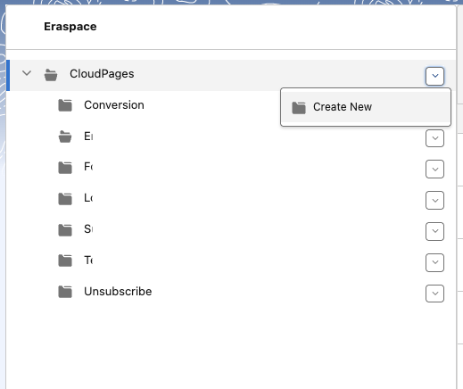
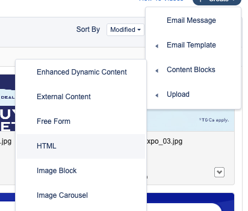

# Cloud Pages Setup

CloudPages combines the best of Marketing Cloud Engagement to capture, organize, and act on prospect data. Use capture forms to grow your audience and then nurture those prospects with a journey. Optimize your content for distinct mobile, social, and web experiences to catch those prospects wherever they are. Built-in reports help you monitor performance and optimize as you go.

Here are some examples of how you can use CloudPages.
- Design landing pages for promotions and solicitations.
- Create microsites for a new products, services, or campaigns.
- Reuse Content Builder blocks for consistency and efficiency.
- Host dynamic, personalized information, such as preferences or profile content.
- Gate content with logins and other custom solutions by using AMPscript.

## Use Case

Store manager need a simple, self-service “cooking station” to build, send, and monitor multi-channel campaigns without jumping between SFMC interfaces.

**Key Ingredients**:
1. Cloud Pages for custom UI
2. Journey Builder for orchestration
3. Data Extensions to store lists, logs, and summaries
4. SSJS/AMPscript & API calls for data operations

**Main Features**:
- Journey Activation: DE Journey Entry triggers → Journey splits & sends based on contact attributes
- WhatsApp Blast: DE Audience CSV → Cloud Page preview & dynamic template → Schedule & send via API
- Automated Reporting: Daily job queries “DE Delivery History” → Emails PDF/CSV report to stakeholders

## Setup
1. Go to Web Studio > Cloud Pages
2. Click **CloudPages** folder, click button arrow right. Then click **Create New**



3. Input folder name
4. Click and Enter your folder, then **Add Content**. Create **Landing Page** 
5. Insert Code:

```html
%%=ContentBlockByName("Content Builder\ssjs-core")=%%

<meta charset="UTF-8">
<title>%%=v(@pageTitle)=%%</title>

<!-- Link external CSS -->
<link rel="stylesheet" href="https://x.pub.sfmc-content.com/2aizoxdgpf1">

<div class="login-container">
    <div class="logo">
        <div class="logo-text">%%=v(@userId)=%%</div>
    </div>

    <form>
        <div class="form-group">
            <label for="username">Username</label>
            <input type="text" id="username" name="username" required="">
        </div>

        <div class="form-group">
            <label for="password">Password</label>
            <input type="password" id="password" name="password" required="">
        </div>

        <button type="submit" class="login-btn">Log In</button>

        <div class="remember-me">
            <input type="checkbox" id="remember" name="remember">
            <label for="remember">Remember me</label>
        </div>
    </form>
</div>

<div class="footer">
    © 2026 YourApp. All rights reserved.
</div>
```

## Key Points

1. Load [ssjs](https://www.ssjsdocs.xyz/) script from Content Builder
```js
%%=ContentBlockByName("Content Builder\ssjs-core")=%%
```

You have to create **Content Block** in **Content Builder**, then select HTML



Insert this code:
```html
<script runat="server">
Platform.Load("Core","1.1.5");

/* SSJS logic */
var pageTitle = "Welcome to CloudPages";
var userId = Request.GetQueryStringParameter("uid") || "Guest";

/* Expose variables to AMPscript */
Variable.SetValue("@pageTitle", pageTitle);
Variable.SetValue("@userId", userId);
</script>
```

Give a name `ssjs-core`

> The goals of this script is for our cloudpages html able to get data from ssjs, which  allows you to accomplish tasks like manipulating data, retrieving data from external systems, creating and updating records, sending emails, and implementing custom logic.

2. In your cloudpages landing page, you can access variable from ssjs-core:
```html
<div class="logo-text">%%=v(@userId)=%%</div>
```

3. Save & Publish