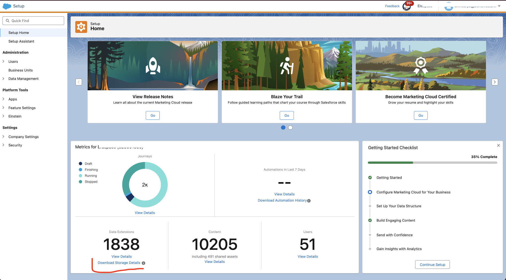
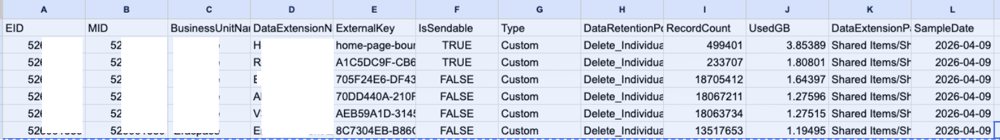

# Calculate Storage Usage and Space

In Marketing Cloud Engagement, to check how much Data Extension storage is being used, we can go to `Setup → Setup Home → Download Storage Details`.



The challenge is that we still need to manually calculate the total usage for each business unit, and then compare that total with the remaining available storage.

**Sample Report:**


## Solution

I created [python script](./script.py) to automatically calculate and show usage report

**Result:**
```bash
  ⚠  34 row(s) had non-numeric UsedGB (e.g. 'Data_Not_Available') — treated as 0 GB.

========================================================================
  STORAGE USAGE REPORT  —  per MID
  Total allocated space : 45.00 GB
========================================================================

  MID              : XX1
  Business Unit    : XX1
  Data Extensions  : 1,820
  Total Records    : 238,930,876
  Used Storage     :   30.46620 GB  (0.029752 TB)  [67.7027% of total 45 GB]
------------------------------------------------------------------------

  MID              : XX2
  Business Unit    : XX2
  Data Extensions  : 406
  Total Records    : 50,221,086
  Used Storage     :    2.97795 GB  (0.002908 TB)  [6.6177% of total 45 GB]
------------------------------------------------------------------------

  ── COMBINED TOTALS ──
  Total Used       :   34.87343 GB  (0.034056 TB)  [77.4965%]
  Remaining Free   :      10.13 GB  (0.0099 TB)       [22.5035%]
========================================================================

  Summary exported → storage_summary_by_mid.csv
```

To make easy for all users, I create static page then deployed in CloudPages. You can see here [index.html](./index.html) or visit this page [http://storage.report](https://mcx3dk6gqx05byn626r3yqc9-hl0.pub.sfmc-content.com/uxvby1dgw35)

What's inside there? _Python script run in browser_

> It means we can run python in cloudpages also