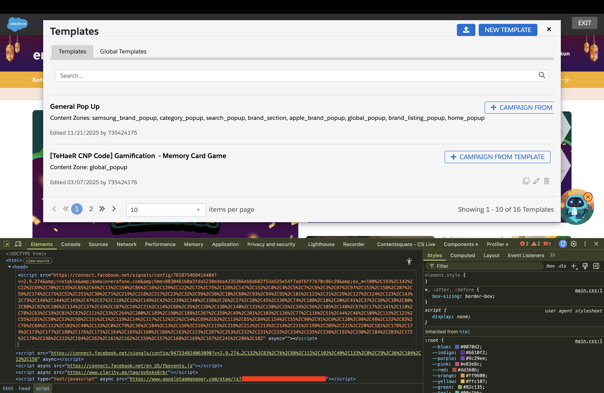

# SF Interactions Resolver

**Background**:
Sometime user can't see the popup from [Salesforce Interactions SDK Launcher](https://chromewebstore.google.com/detail/salesforce-interactions-s/mhmpepeohaddbhkhecaldflljggicedf), after inspection we checked some requests are blocked. 

A Chrome extension used to mitigate cases where the Salesforce Interactions SDK Launcher blocks or interferes with network requests in Chrome.

**What it does:** It lets you quickly switch Chrome to a PAC-based proxy route and switch back to direct mode when needed. This helps isolate or bypass request issues during troubleshooting.

**Scope:** Only Chrome traffic in the profile where the extension is installed. Other browsers and apps are unchanged (browser proxy, not a system VPN).

---

## Prerequisites

- A **public hosted PAC file** URL from your proxy provider.
- A Chrome profile where this extension is installed.

If you don’t have this yet, see [Proxy setup](#proxy-setup) below.

---

## Installation

1. Clone or download this repo and open the `sf-proxy` folder.
2. In Chrome, go to `chrome://extensions`, turn on **Developer mode**, then **Load unpacked** and select the `sf-proxy` directory.
3. Click the extension icon and use **Connect** / **Disconnect** to turn the proxy on or off.

---

## Usage

- **Connect** – Sets Chrome’s proxy to your PAC URL. All Chrome traffic goes through the proxy until you disconnect.
- **Disconnect** – Sets Chrome back to direct (no proxy). Traffic no longer goes through the proxy.

If your proxy requires authentication, the first time you connect you may be redirected to sign in. After that, you stay connected until you disconnect or the session expires.

---

## Project layout

| File            | Purpose                                                |
|-----------------|--------------------------------------------------------|
| `manifest.json` | MV3 manifest; `proxy` and `storage` permissions        |
| `background.js` | Service worker: set/clear proxy, restore on startup    |
| `popup.html`    | Popup UI (Connect / Disconnect, status)                |
| `popup.js`      | Popup logic; read/write connection state and PAC URL   |
| `options.html`  | (Optional) Page to set PAC URL                          |
| `options.js`    | (Optional) Save PAC URL to storage                      |

---

## Limitations

- **Chrome only:** Proxy applies only to Chrome and only in the profile where the extension is installed.
- **Not system VPN:** Other applications and browsers are not affected.
- **Proxy persistence:** Chrome does not persist extension proxy across restarts; the extension reapplies the proxy on startup if it was previously connected (using stored state).
- **Access control:** The hosted PAC URL can be public; who can use the proxy should be enforced by your provider's access controls.

---

## Related extension context

This project is intended as a support utility when testing issues around Salesforce's extension behavior:
- [Salesforce Interactions SDK Launcher](https://chromewebstore.google.com/detail/salesforce-interactions-s/mhmpepeohaddbhkhecaldflljggicedf)

In practice, use this resolver to compare traffic behavior with and without PAC-based routing when requests are intermittently blocked.

